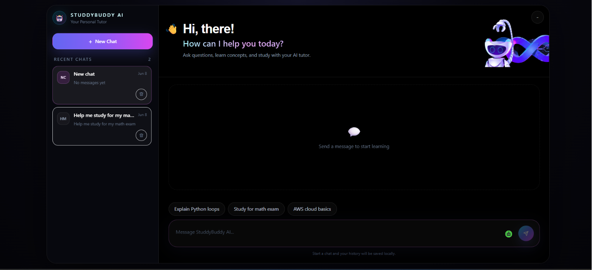
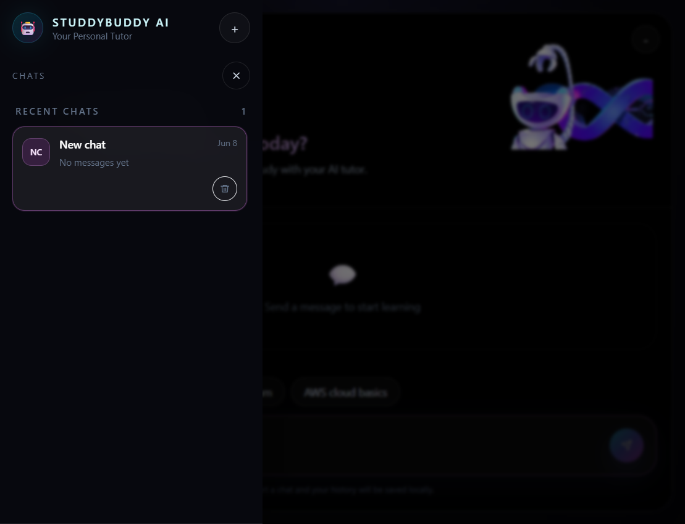
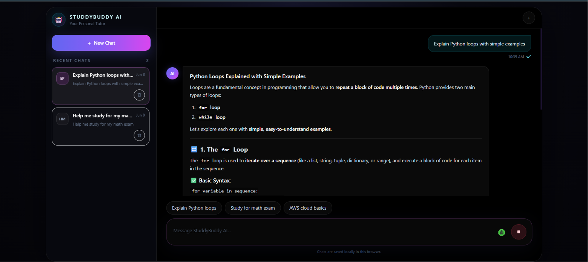
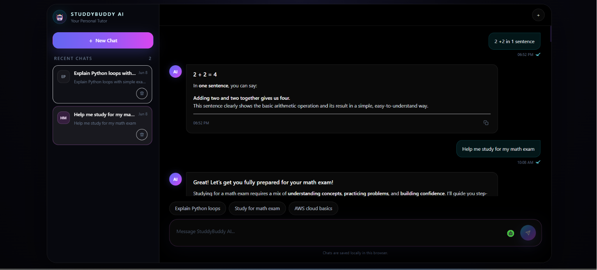
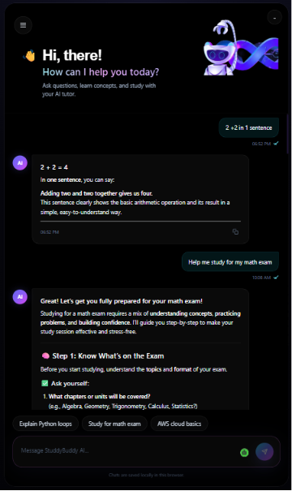

# StuddyBuddy AI

StuddyBuddy AI is a streaming AI study assistant built with Next.js on the frontend and AWS on the backend. It lets users ask questions, get streamed responses, and keep their conversation history in the browser.

This repository was adapted from the AWS workshop starter project for a streaming AI personal assistant. Credit goes to the original workshop authors for the base architecture and learning flow. The app here has been modified into **StuddyBuddy AI** with a custom UI, branding, and local chat experience.

Original Repository : [https://github.com/awsccsheridan/streaming-chatbot]

## What It Does

- Streams AI responses in real time.
- Saves conversation history locally in the browser.
- Lets you start new chats, switch between threads, and delete old chats.
- Includes quick prompt buttons for common study questions.
- Supports a responsive layout with a collapsible sidebar on mobile.
- Is ready for frontend hosting on AWS Amplify.

## Tech Stack

- Next.js
- React + TypeScript
- AWS CDK
- AWS Lambda Function URL
- Lambda Response Streaming
- Amazon Bedrock with Amazon Nova 2 Lite
- AWS Amplify for frontend deployment

## Screenshots

Homepage view:



Sidebar view:



Generating response view:



Responsive view:

## Project Structure

```txt
streaming-chatbot/
├── src/
│   ├── app/
│   │   ├── page.tsx
│   │   ├── layout.tsx
│   │   └── globals.css
│   ├── components/
│   │   └── chat/
│   │       ├── ChatApp.tsx
│   │       ├── ChatConversation.tsx
│   │       └── ChatSidebar.tsx
│   ├── hooks/
│   │   └── useChatHistory.ts
│   └── lib/
│       └── chat-storage.ts
├── public/
│   └── screenshots/
├── backend/
│   ├── bin/
│   ├── lib/
│   └── lambda/
└── README.md
```

## Local Setup

Install dependencies:

```bash
npm install
```

Then install the backend dependencies:

```bash
cd backend
npm install
```

Set up your frontend environment file:

```bash
cp .env.example .env.local
```

Add your Lambda Function URL to `.env.local`:

```env
NEXT_PUBLIC_LAMBDA_URL=https://your-lambda-function-url.lambda-url.us-east-1.on.aws/
```

Run the app locally:

```bash
npm run dev
```

Open the app in your browser:

```txt
http://localhost:3000
```

## Backend Setup

The backend is deployed with AWS CDK. From the `backend` folder:

```bash
npx cdk bootstrap
npx cdk deploy
```

After deployment, copy the `ChatbotApiUrl` output and place it in `NEXT_PUBLIC_LAMBDA_URL` for the frontend.

## Notes

- If `NEXT_PUBLIC_LAMBDA_URL` is missing, the chat UI will show an error instead of calling the backend.
- Bedrock access must be enabled for the AWS account and region you deploy to.
- This project keeps chat history local to the browser, so clearing browser storage will remove old chats.

## Credit

Original workshop inspiration and starter structure came from the AWS workshop version of this project. This repository was modified from that base to create StuddyBuddy AI.
